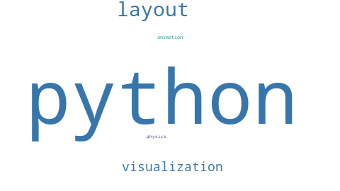
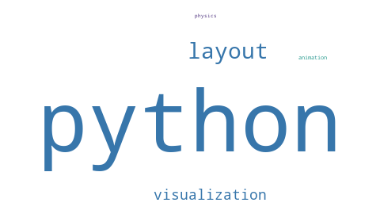
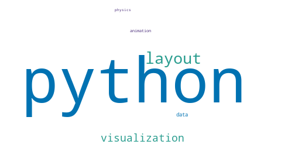
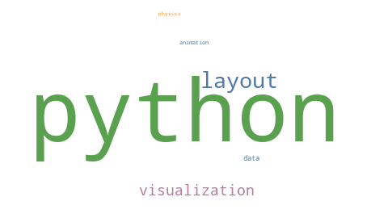
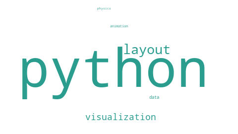
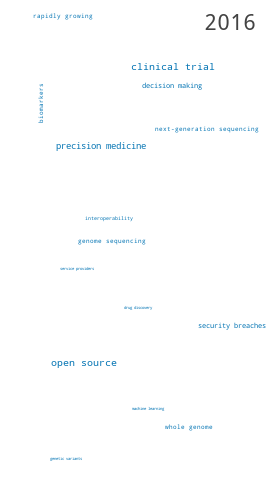

# Kinematic Word Cloud

Kinematic Word Cloud is an early-stage experiment for animating word clouds from
tabular keyframe data.

The project goal is to combine two useful ideas:

- Use [`word_cloud`](https://github.com/amueller/word_cloud) for high-quality
  word placement, masks, font sizing, colors, and rendering.
- Add a lightweight physics/tweening layer so words can grow, shrink, drift, and
  make room for each other across keyframes.

This is intentionally not a text-mining project. The primary input should be a
table of words and values over time.

## Target Input

The first supported format should be a wide keyframe table:

```csv
word,color,group,2024-01,2024-02,2024-03
python,#3776AB,language,10,25,5
visualization,,design,4,18,22
animation,,motion,0,8,30
```

See [examples/simple_keyframes.csv](examples/simple_keyframes.csv) for a tiny
fixture with five words and three keyframes. It includes one word shrinking from
large to small, one growing to its maximum in the final frame, and one peaking
in the middle frame.

See [examples/bioit_top_terms_2016_2026.csv](examples/bioit_top_terms_2016_2026.csv)
for a larger fixture generated from BioIT abstract phrase frequencies. It uses
the union of the top 10 phrases by `corpus_freq` for each year from 2016 through
2026.

The `color` and `group` columns are optional metadata:

- `color`: explicit word color as `#RGB` or `#RRGGBB`.
- `group`: words in the same group receive the same deterministic color unless
  the word has an explicit `color`.
- words without either receive a deterministic fallback palette color.

A long format can be supported as a convenience:

```csv
frame,word,value
2024-01,python,10
2024-02,python,25
2024-01,visualization,4
```

## Proposed Architecture

1. Normalize the keyframe table into a matrix of `word x frame -> value`.
2. Compute each word's peak value across all frames.
3. Generate an initial packed layout with `word_cloud.WordCloud` from those peak
   values.
4. Create one physics body per word at its layout position.
5. Anchor each body near its original layout position with a spring-like force.
6. For every rendered frame:
   - interpolate values between adjacent keyframes,
   - resize each word's collision body to the current value,
   - step the physics world,
   - draw words at the current physics positions using Pillow or `word_cloud`
     layout data,
   - write the frame to an image or video encoder.

## Design Decisions

- Generate initial layout from peak values so the first layout is collision-aware
  for the largest expected word sizes.
- Use current-size collision bodies when we want words to fill newly freed space.
- Use max-size collision bodies when we want stable reserved space.
- Keep the animation deterministic by default with explicit random seeds.
- Treat text parsing as out of scope for the core library.

## Early Milestones

1. Load and validate wide CSV keyframe data.
2. Generate a static peak-value word cloud from the table.
3. Render interpolated frames with fixed positions.
4. Add physics-driven current-size collision bodies.
5. Export GIF, MP4, or SVG output.

## Status

This repository is newly scaffolded. The first prototype can load a wide
keyframe CSV, render static and interpolated PNG frames, optionally use the
lightweight physics solver, and export GIF, MP4, or sampled animated SVG.

## Examples

Preview assets are generated by:

```bash
python3 scripts/render_examples.py
```

### Layout Motion

| Fixed positions | Physics positions |
| --- | --- |
|  |  |

### Color Modes

| Single color | Group colors | Word colors |
| --- | --- | --- |
|  |  |  |

### Interpolation

| Linear | Smoothstep |
| --- | --- |
|  |  |

### Vertical Social Format



## Install

After the first release is published to PyPI, install it with:

```bash
pip install kinematic-word-cloud
```

Then render a CSV from the installed CLI:

```bash
kwc --input path/to/keyframes.csv --exports gif mp4
```

The package exposes both `kinematic-word-cloud` and the shorter `kwc` console
commands.

Use it as a Python SDK:

```python
from kinematic_word_cloud import RenderOptions, render_animation

result = render_animation(
    RenderOptions(
        input_path="examples/simple_keyframes.csv",
        output_dir="output/sdk_frames",
        output="output/sdk_demo",
        exports=("gif",),
        frames_per_transition=12,
    )
)

print(result.frame_paths)
print(result.export_paths)
```

## CLI Usage

Render the first static peak-value cloud from the example data:

```bash
python3 scripts/create_starting_cloud.py
```

The script writes `output/starting_cloud.png`.

Render interpolated PNG frames:

```bash
kwc --input examples/simple_keyframes.csv
```

By default, the CLI uses fixed word positions and writes a PNG sequence to
`output/fixed_frames/`.

Choose output destinations:

```bash
kwc --input examples/simple_keyframes.csv --frames-only --output-dir output/demo_frames
kwc --input examples/simple_keyframes.csv --exports svg --output output/demo.svg
kwc --input examples/simple_keyframes.csv --exports gif mp4 --output output/demo
kwc --input examples/simple_keyframes.csv --output-dir output/demo_frames
```

When multiple export formats are selected, `--output` is treated as a filename
stem and the CLI appends `.gif`, `.mp4`, or `.svg`.

The default canvas is 16:9 at `1280x720`. Use `--aspect` to switch presets:

```bash
kwc --input examples/simple_keyframes.csv --aspect 1:1
kwc --input examples/simple_keyframes.csv --aspect 9:16
```

SVG export uses the same canvas as its `viewBox`, so it scales cleanly while
keeping the selected layout aspect ratio.

Set a custom background color:

```bash
kwc --input examples/simple_keyframes.csv --background-color '#111111'
```

In TOML, use `background_color = "#111111"`.

For video-editor compositing, render transparent PNG overlay frames:

```bash
kwc --input examples/simple_keyframes.csv \
  --frames-only \
  --background-color transparent \
  --output-dir output/overlay_frames
```

Import the PNG sequence into a video editor such as DaVinci Resolve, place it
above your background footage or image layer, and do the final audio, movement,
transitions, and color work there. Standard MP4 export uses H.264 and does not
preserve alpha, so `--background-color transparent --exports mp4` is rejected.
Use `exports = ["frames"]` or `frames_only = true` in TOML for the same overlay
workflow.

Add a per-word raster bloom effect:

```bash
kwc --input examples/simple_keyframes.csv --exports gif mp4 --background-color '#111111' --bloom
```

Bloom radius scales with each word's current animated font size, so growing
words develop a larger glow and shrinking words fade back to a smaller halo.
Tune the effect with `--bloom-radius-scale`, `--bloom-min-radius`,
`--bloom-max-radius`, `--bloom-strength`, `--bloom-color`,
`--bloom-source`, `--bloom-edge-width`, `--bloom-intensity-mode`,
`--bloom-intensity-power`, and `--bloom-layers`. By default, bloom is generated
from a stable 1px edge mask so the glow follows letter outlines instead of
blurring the full filled letter shapes. The blur radius is calculated from the
word's continuous animated size, which helps avoid visible pulsing between
integer font sizes. Bloom strength is also scaled by absolute current word size,
so words at the same rendered size get the same glow strength and smaller words
do not get full-power halos just because they are at their own peak. Use
`--bloom-intensity-mode relative` to scale strength by each word's current size
relative to its peak, or `--bloom-intensity-mode constant` to keep constant
bloom strength. Use `--bloom-source fill` for the older filled blur style. Each
word blooms in its own color by default; use `--bloom-color word` to make that
explicit. Use `--bloom-color white` for a brighter white halo behind colored
words:

```bash
kwc --input examples/simple_keyframes.csv --exports gif mp4 --background-color '#111111' --bloom --bloom-color white
```

In TOML, use either `bloom = true` for defaults or a `[bloom]` table:

```toml
[bloom]
enabled = true
radius_scale = 0.08
min_radius = 1.5
max_radius = 18
strength = 2.0
color = "word"
source = "edge"
edge_width = 2
intensity_mode = "absolute"
intensity_power = 1.0
layers = 2
```

Bloom is currently applied to generated PNG frames, GIF, and MP4 output. SVG
export ignores the bloom settings for now.

Render with a different input CSV:

```bash
kwc --input examples/bioit_top_terms_2016_2026.csv
```

Keep segment renders on a shared value scale:

```bash
kwc --input examples/simple_keyframes.csv --size-max-value 1.0
```

By default, each CSV is sized relative to its own largest value. Use
`--size-max-value` when a local peak should stay smaller than a later global
peak, such as rendering a song section where values top out at `0.75` but a
later section will reach `1.0`. Values above the max are capped for sizing and
physics calculations. In TOML, use `size_max_value = 1.0`.

Use a TOML config file instead of repeating CLI parameters:

```bash
kwc --config examples/bioit_svg_config.toml
```

CLI flags override config-file settings. For example, `--exports svg mp4`
renders both export formats from the configured run.

Config files are TOML. The CLI loads the config through the package-level render
config helpers before calling the rendering and export modules. Export formats
use the same list shape in config and the CLI: `exports = ["svg", "mp4"]`,
`exports = ["frames"]`, `--exports svg mp4`, or `--exports svg,mp4`.
Relative paths in a config file are resolved from the config file's directory.
Without a config file, relative paths are resolved from the current working
directory.

Render long or sparse timelines with per-scene layouts:

```bash
kwc --config examples/scene_config.toml
```

Scene mode uses a single wide CSV with global frame columns plus `scene`, `word`,
and optional `id`, `type`, `asset`, `asset_scale`, `layer`, `color`, `group`,
`x`, and `y` columns. Define the scene cuts in TOML:

```toml
layout_mode = "scene"
scene_starts = { intro = "s001", chorus = "s004", outro = "s006" }
```

Each scene is laid out from only its own rows and frame span, so sparse long
animations stay denser than a single global layout. `id` defaults to `word` and
is used to carry positions across scenes. Optional `x` and `y` values are
normalized center coordinates from `0` to `1`; they seed or override a word or
image item's position.

By default, scene mode uses `wordcloud` positions as anchors. For sparse scenes
where you want active items pulled into a dense center cluster, use settled
center positioning:

```bash
kwc --config examples/scene_config.toml --scene-positioning settled-center --scene-settle-steps 120
```

In TOML, use `scene_positioning = "settled-center"` and optionally
`scene_settle_steps = 120`. This mode still uses `wordcloud` for word sizing,
color, and orientation, but seeds new scene items around the canvas, anchors
them to the center, runs hidden physics warmup, and starts rendering from the
settled state. Recurring `id` values inherit their previous final positions and
stay locked during the hidden warmup so new scene items settle around them.

Scene mode can also render static image assets as animated cloud items. Use
`type = "image"` with explicit `id` and `asset` values:

```csv
scene,id,word,type,asset,asset_scale,layer,x,y,s001,s002
chorus,logo,,image,logo.png,0.25,front,0.50,0.55,0,1
```

PNG, JPEG, and WebP assets are supported for raster outputs; image asset paths
are resolved relative to the CSV file. Image rows must have an explicit `id`, a
supported `asset`, and a positive `asset_scale` when `asset_scale` is supplied.
Image rows also need `x` and `y` unless that same `id` inherits a position from
an earlier scene.

`asset_scale` is responsive. It fits the source image inside a box whose width
and height are that fraction of the render canvas, preserving the source aspect
ratio. On a `1280x720` canvas, an `800x600` image with `asset_scale = 1.0`
peaks at `960x720`; `asset_scale = 0.5` peaks at `480x360`; values above `1.0`
are allowed and can crop at the canvas edges. The animated frame values then
scale from zero to that peak size.

Optional image `layer` values are `front` or `back`, with `front` as the
default. `front` draws the image over the words; `back` draws it behind the
words. Both layers still participate in physics. Run scene mode with `--physics`
when images should participate in spacing; without physics, explicit and
inherited centers can overlap because they override the word-cloud layout.
Scene mode currently supports PNG frames, GIF, and MP4. SVG scene export is not
implemented yet.

Choose deterministic color behavior:

```bash
kwc --input examples/simple_keyframes.csv --palette okabe-ito --color-by group
kwc --input examples/simple_keyframes.csv --palette-file examples/palette_bioit.hex --color-by word
kwc --input examples/simple_keyframes.csv --color-by single --default-color '#222222'
kwc --input examples/simple_keyframes.csv --color-by absolutechange --interpolation rapid25
kwc --input examples/simple_keyframes.csv --color-by scaledchange --scaledchange-colors '#C81D25,#F7C548,#00A676'
kwc --input examples/simple_keyframes.csv --group-color 'design=#2A9D8F' --group-color 'motion=#4A2C7A'
```

Available palettes are `default`, `tableau`, and `okabe-ito`. `color_by` can be
`group`, `word`, `single`, `absolutechange`, or `scaledchange`. Spreadsheet
`color` values win first for static modes. In `group` mode, configured group
colors win next, then palette-derived group colors. Ungrouped words use
deterministic palette colors unless `color_by` is `single`, in which case they
use `default_color`.

Word colors can include alpha with `#RRGGBBAA` or shorthand `#RGBA`, such as
`#FF4DA680` for a roughly 50% opaque pink. This works for spreadsheet `color`
values, `default_color`, configured group colors, and change-mode color stops,
and is especially useful with transparent PNG overlay frames.

`absolutechange` mode overrides spreadsheet colors, group colors, palettes, and
`default_color` at render time. Words use the no-change color when their start
and end values for the current keyframe transition are equal, the growth color
when the next keyframe is larger, and the decline color when the next keyframe
is smaller. The transition color is held until the next keyframe, which is
especially useful with interpolation modes such as `rapid25`, `bounce`, and
`elastic`. SVG exports use the same sampled colors with discrete fill changes.
The default colors are growth `#2EAD4D`, decline `#D62828`, and no-change
`#F2C94C`.

Configure absolute-change colors on the CLI:

```bash
kwc --input examples/simple_keyframes.csv \
  --color-by absolutechange \
  --absolutechange-growth-color '#00A676' \
  --absolutechange-decline-color '#C81D25' \
  --absolutechange-no-change-color '#F7C548'
```

Or use a grouped TOML table:

```toml
color_by = "absolutechange"

[absolutechange]
growth_color = "#00A676"
decline_color = "#C81D25"
no_change_color = "#F7C548"
```

`scaledchange` mode also overrides static colors at render time, but maps the
signed keyframe-to-keyframe change onto an ordered color scale. The scale is
global and symmetric around zero: the largest decline maps to the first color,
no change maps to the center of the color ramp, and the largest growth maps to
the last color. Color stops are blended with smoothstep easing between stops.
The default color scale is `["#D62828", "#F2C94C", "#2EAD4D"]`.

Configure scaled-change colors on the CLI:

```bash
kwc --input examples/simple_keyframes.csv \
  --color-by scaledchange \
  --scaledchange-colors '#C81D25,#F7C548,#00A676'
```

Or use a grouped TOML table:

```toml
color_by = "scaledchange"

[scaledchange]
colors = ["#C81D25", "#F7C548", "#00A676"]
```

In TOML, group overrides use a `[group_colors]` table:

```toml
palette = "okabe-ito"
color_by = "group"

[group_colors]
design = "#2A9D8F"
motion = "#4A2C7A"
```

TOML can also use an inline custom palette or import a simple palette file:

```toml
palette = ["#0072B2", "#009E73", "#D55E00"]

# or
palette_file = "examples/palette_bioit.hex"
```

`palette_file` supports plain text or `.hex` files with one hex color per line,
plus GIMP/Inkscape `.gpl` palette files. Binary Adobe `.ase` and `.aco` files
are common palette exchange formats, but they are not supported yet.

Render keyframe labels as an overlay:

```bash
kwc --input examples/simple_keyframes.csv --label-mode keyframe --label-position top-left
```

The first label mode uses the table's frame labels, such as `2016`, `2017`,
or `2026`. Labels are drawn as a separate overlay layer, so they do not affect
word-cloud placement or physics.

Render the same sequence with the lightweight physics solver enabled:

```bash
kwc --input examples/simple_keyframes.csv --physics
```

The physics path writes to `output/physics_frames/`.

Physics mode uses the first keyframe's word-cloud layout as the anchor layout,
then lets later growth/shrinkage push words around with current-size collision
bodies.

Export GIF and MP4 outputs:

```bash
kwc --input examples/simple_keyframes.csv --exports gif mp4
kwc --input examples/simple_keyframes.csv --physics --exports gif mp4
```

GIF export uses Pillow. MP4 export uses the local `ffmpeg` binary.
The default playback rate is 12 fps. Use `--fps` for playback rate and
`--frames-per-transition` for interpolation density:

```bash
kwc --input examples/simple_keyframes.csv --exports gif --fps 12 --frames-per-transition 24
```

You can also set total duration or per-transition duration. In duration mode,
`--fps` becomes the target frame rate, still defaulting to 12 fps, and the
the renderer calculates the rendered frames per transition:

```bash
kwc --input examples/simple_keyframes.csv --exports gif --total-duration 6 --fps 24
kwc --input examples/simple_keyframes.csv --exports mp4 --seconds-per-transition 2 --fps 24
```

The renderer nudges the effective FPS when needed so the animation lands exactly
on each keyframe and still matches the requested duration.

Choose how values move between keyframes:

```bash
kwc --input examples/simple_keyframes.csv --interpolation linear
kwc --input examples/simple_keyframes.csv --interpolation smoothstep
kwc --input examples/simple_keyframes.csv --interpolation rapid25
kwc --input examples/simple_keyframes.csv --interpolation rapid50
kwc --input examples/simple_keyframes.csv --interpolation bounce
kwc --input examples/simple_keyframes.csv --interpolation elastic
kwc --input examples/simple_keyframes.csv --interpolation catmull-rom
kwc --input examples/simple_keyframes.csv --interpolation monotone-cubic
```

`linear` changes values at a constant rate. `smoothstep` eases in and out of
each transition while still landing exactly on every keyframe. `rapid10`,
`rapid25`, and `rapid50` make a linear change during the first 10%, 25%, or 50%
of each transition, then hold the destination keyframe value. `rapid` is an
alias for `rapid25`. `bounce` moves past the destination by a small amount,
settles back by halfway through the transition, then holds the destination
keyframe value. `elastic` uses a damped oscillating ease-out curve to overshoot
and settle by the next keyframe. Bounce and elastic clamp negative values to
zero, but they can briefly exceed surrounding keyframe values and may produce
temporary overlaps. `catmull-rom` uses neighboring keyframes to smooth velocity
through keyframe boundaries, preserving exact keyframe values and clamping
negative interpolated values to zero. Because Catmull-Rom is not monotone, it
can overshoot above local keyframe values. `monotone-cubic` uses limited cubic
Hermite slopes to smooth between keyframes while keeping each interpolated value
between its surrounding keyframe values. Use `linear` or `smoothstep` when
simple segment-local behavior matters most.

Export sampled animated SVG:

```bash
kwc --input examples/simple_keyframes.csv --exports svg
kwc --input examples/simple_keyframes.csv --physics --exports svg
```

SVG export writes browser-playable SMIL animation to `output/fixed_animation.svg`
or `output/physics_animation.svg`. It samples the same timeline as the PNG
renderer and animates each word's translation, font size, and opacity. Because
the SVG uses browser text rendering, exact glyph bounds may differ slightly from
the Pillow-rendered PNG/MP4/GIF outputs.
